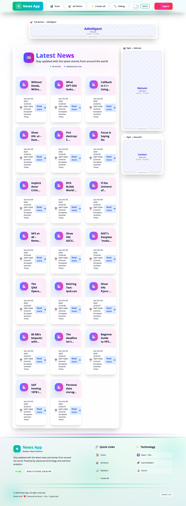
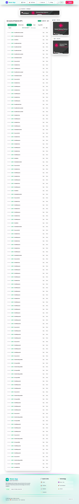
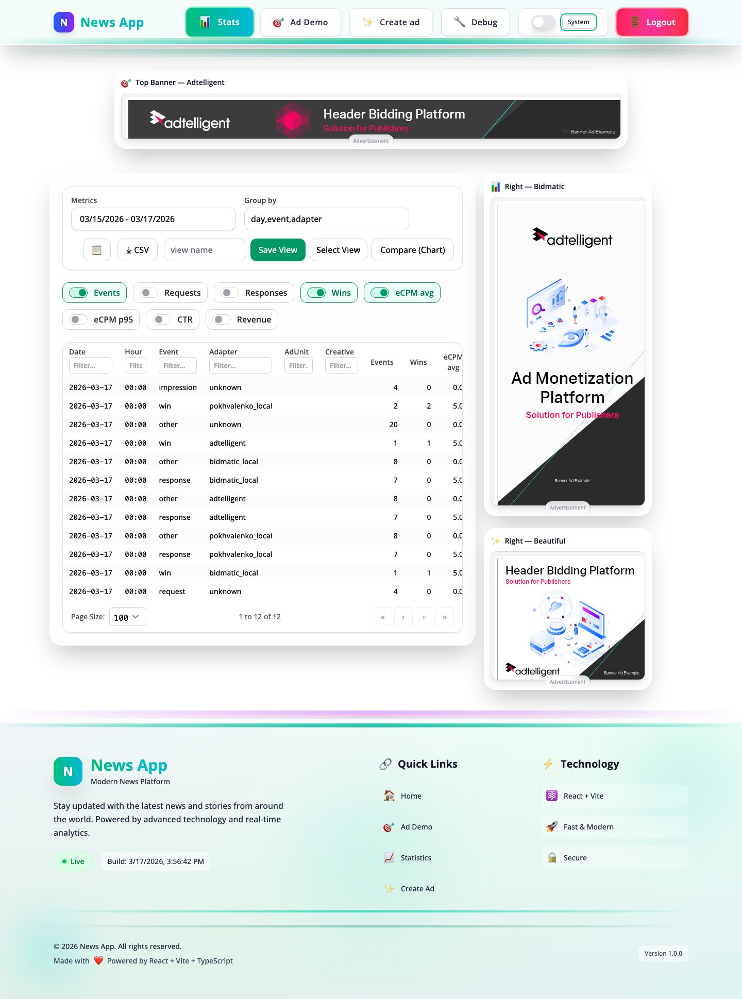

# AdTell — News App with Ad Auction System

A news application with a built-in programmatic advertising platform. Features real-time header bidding via Prebid.js, multi-adapter auction system, analytics dashboard, and full user authentication.

## Demo

[Live Demo](https://adtell-react-app.vercel.app/)

> **Note:** Disable your ad blocker to see the ad auction system in action.

## Screenshots





## Tech Stack

**Frontend:** React 19, TypeScript, Vite 7, Tailwind CSS 4, Headless UI
**State:** Zustand, TanStack Query
**Forms:** React Hook Form + Zod
**Ads:** Prebid.js, custom bid adapters, virtual modules
**Monitoring:** Sentry (errors, performance, session replay)
**Testing:** Vitest, React Testing Library
**Code Quality:** Biome, Husky
**Deploy:** Vercel (FE), Render (BE)

## Features

- **Header Bidding** — Prebid.js auction with multiple demand partners (Adtelligent, Bidmatic, custom adapters)
- **Virtual Modules** — Vite virtual modules for dynamic ad system loading (`virtual:ads-config`, `virtual:ads-module`, `virtual:ads-analytics`, `virtual:ads-bridge`)
- **Ad Slot Management** — responsive ad slots (top banner, sidebars, mobile) with auto-refresh
- **Auction Debug Page** — real-time auction logs, bid responses, CPM tracking
- **Analytics Dashboard** — stats with Recharts (pageLoad, auctionInit, bidWon events)
- **Authentication** — login/register with JWT, protected routes, auth state hydration
- **News Feed** — article list with modal preview and full article pages
- **Dark/Light Theme** — toggle with Tailwind CSS class-based dark mode
- **Error Monitoring** — Sentry with custom error boundaries and session replay
- **Code Splitting** — lazy-loaded routes, vendor chunk splitting, Brotli compression

## Architecture

```
src/
├── components/        # Shared UI (Header, Footer, Layout, ads/, form/, ui/)
├── features/          # Feature modules
│   ├── auth/          # Login, Register, validation schemas
│   ├── news/          # Feed, ArticlePage, NewsModal
│   ├── ads/           # AdDemo, AdsDebugPage, AuctionStats, CreateAd
│   └── stats/         # Stats dashboard (hooks, components, utils)
├── lib/               # Core utilities
│   ├── ads/           # Ad UID, prebid analytics, window bridge
│   ├── analytics/     # Event reporter, queue, events
│   ├── api.ts         # API client with auth interceptor
│   └── sentry.ts      # Sentry initialization
├── store/             # Zustand stores (auth, theme, tabs, users)
├── routes/            # AppRoutes with auth guards
├── reporting/         # ErrorBoundary, error/analytics reporting
└── types/             # TypeScript definitions, virtual module types

modules/               # External ad modules (loaded at runtime)
├── prebid.auction.js  # Prebid.js auction orchestration
├── google.only.js     # Google GAM integration
├── analytics.module.js
├── adtelligentBidAdapter.js
├── bidmaticBidAdapter.js
├── customBidAdapter.js
└── beautifulAdAdapter.js
```

## Getting Started

```bash
git clone https://github.com/Opokhvalenko/Adtell-react-app.git
cd Adtell-react-app
npm install
npm run dev
```

## Environment Variables

Copy `.env.example` and configure:

```env
VITE_API_URL=http://localhost:3000
VITE_ENABLE_ADS=true
VITE_ADS_MODULE=prebid
VITE_ENABLE_PREBID=true
VITE_ADS_DEBUG=true
VITE_SENTRY_DSN=               # optional
```

See `.env.example` for all available options (ad adapters, analytics, Sentry).

## Scripts

```bash
npm run dev            # Start dev server (port 5173)
npm run build          # Production build
npm run preview        # Preview production build
npm test               # Run tests
npm run test:coverage  # Tests with coverage
npm run lint           # Biome lint
npm run format         # Biome format
npm run type-check     # TypeScript check
npm run build:analyze  # Bundle analysis (stats.html)
```

## License

MIT
